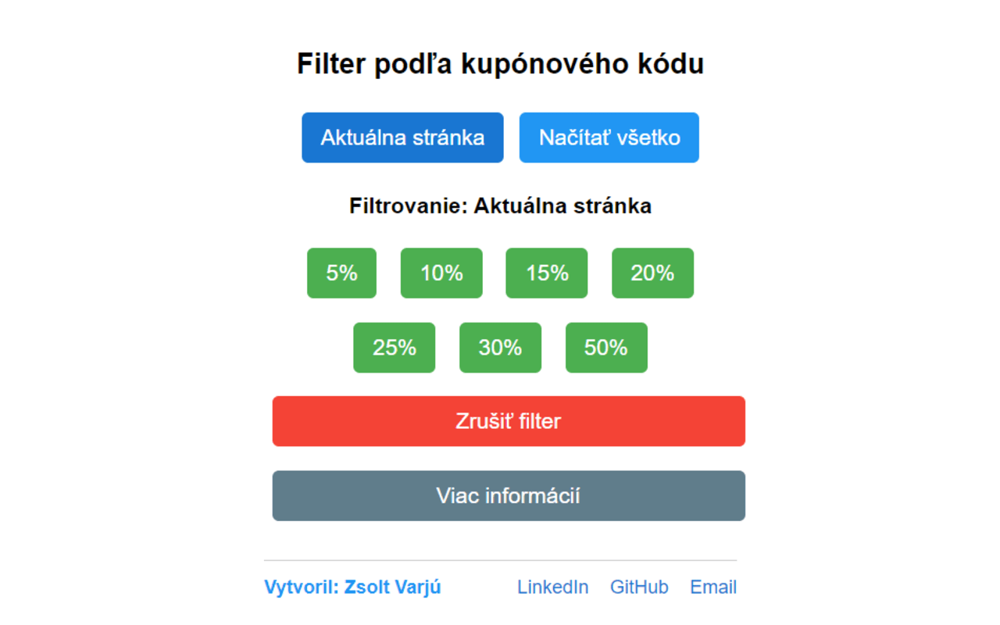
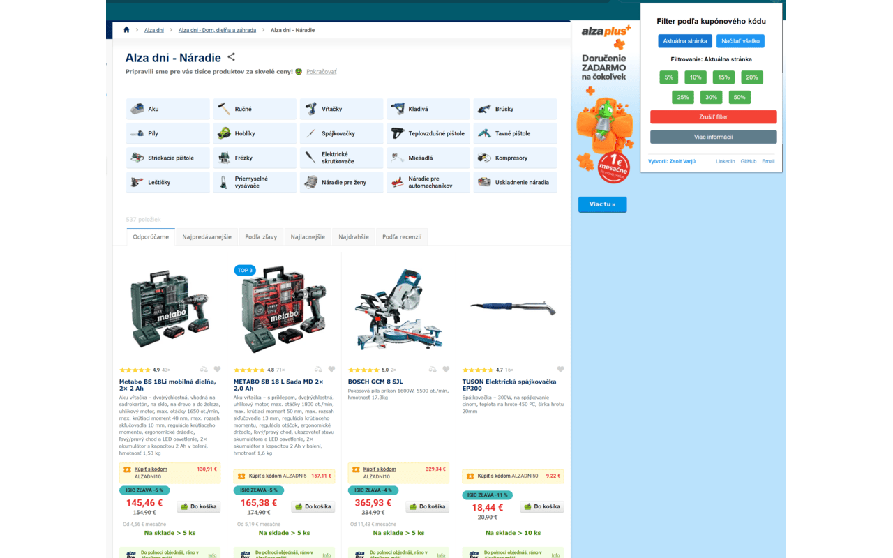
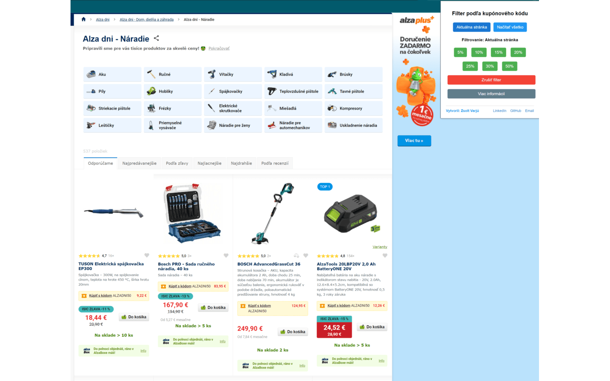

# Alza Dni Kupónový Filter

Alza Dni Kupónový Filter je užitočný nástroj pre všetkých, ktorí nakupujú počas Alza Dní. Toto rozšírenie vám umožňuje jednoducho filtrovať produkty podľa rôznych kupónových kódov, čo vám pomôže rýchlo nájsť najlepšie zľavy na Alza.sk.

## Hlavné funkcie

- Filtrovanie produktov podľa kupónových kódov (5%, 10%, 15%, 20%, 25%, 30%, 50%)
- Možnosť filtrovať iba aktuálne zobrazené produkty alebo načítať všetky
- Jednoduchý a prehľadný užívateľský interfejs
- Rýchle odstránenie filtra jedným kliknutím

## Inštalácia

1. Stiahnite si najnovšiu verziu rozšírenia.
2. Otvorte Chrome a prejdite na `chrome://extensions`.
3. Zapnite "Režim pre vývojárov" v pravom hornom rohu.
4. Kliknite na "Načítať rozbalené" a vyberte priečinok s rozšírením.

## Použitie

1. Kliknite na ikonu rozšírenia v paneli nástrojov prehliadača.
2. Vyberte želaný kupónový kód kliknutím na príslušné tlačidlo.
3. Rozšírenie automaticky filtruje produkty na stránke Alza.sk.

### Bez filtra

### S aplikovaným filtrom

## Prispievanie

Príspevky sú vítané! Ak máte nápady na zlepšenie alebo ste našli chybu, neváhajte otvoriť issue alebo poslať pull request.

## Autor

Vytvoril [Zsolt Varjú](https://github.com/zsoolti8917)
         [LinkedIn](https://www.linkedin.com/in/zsoltvarju/)
